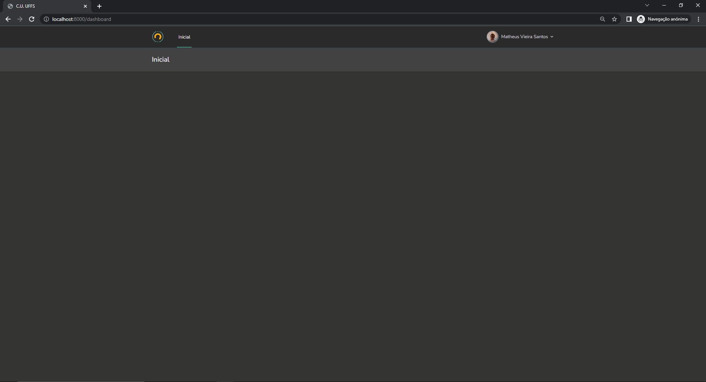

<p align="center">
    <br />
</p>

# C.U. UFFS

O Cadastro Único da UFFS é um sistema cujo princiapl objetivo é a centralização dos serviços prestados para a comunidade acadêmica da [Universidade Federal da Fronteira Sul (UFFS)](https://www.uffs.edu.br). Entre as principais funcionalidades estão a geração da carteirinha de estudante, o controle das entradas do Restaurante Universitário e agendamento de salas.

> **IMPORTANTE:** o serviço está em desenvolvimento.

## ✨ Features

O C.U. possui um conjunto modesto de features:

- Autenticação a partir do idUFFS;
- Geração da carteirinha;
- Informações de perfil.



## 🚀 Começando

### 1. Dependências

Para executar o projeto, você precisa ter o seguinte instalado (preceisa `php >= 8.1`).:

- [Git](https://git-scm.com);
- [PHP 8.x](https://www.php.net/downloads);
- [Composer](https://getcomposer.org/download/);
- [NodeJS](https://nodejs.org/en/);
- [NPM](https://www.npmjs.com/package/npm);
- [ImageMagick](https://imagemagick.org/script/download.php)

> _IMPORTANTE:_ se sua distribuição linux não tem PHP 8.x disponível, rode `sudo add-apt-repository ppa:ondrej/php` antes de começar.

Você precisa de várias extensões PHP instaladas também:

```
sudo apt-get update
sudo apt install php8.1-cli php8.1-mbstring php8.1-zip php8.1-xml php8.1-curl php8.1-pgsql php8.1-curl php-imagick php8.1-pdo_pgsql
```

### 2. Configuração

Feito a instalação das dependências, é necessário obter uma cópia do projeto. A forma recomendada é clonar o repositório para a sua máquina.

Para isso, rode:

```
git clone --recurse-submodules https://github.com/vieir4ndo/cu-uffs && cd cu-uffs
```

Isso criará e trocará para a pasta `cu-uffs` com o código do projeto.

#### 2.1 PHP

Instale as dependências do PHP usando o comando abaixo:

```
composer install
```

#### 2.2 Banco de Dados

O banco de dados utilizado é o postgres.

#### 2.3 Node

Instale também as dependências do NodeJS executando:

```
npm install
```

#### 2.4 Laravel

Crie o arquivo `.env` a partir do arquivo `.env.example` gerado automaticamente pelo Laravel:

```
cp .env.example .env
```

Informe as credenciais de sua instancia do banco no arquivo `.env`
```
DB_CONNECTION=pgsql
DB_HOST=127.0.0.1
DB_PORT=5432
DB_DATABASE=cuuffs
DB_USERNAME=postgres
DB_PASSWORD=
```

Informe as credenciais do SMTP MailJet
```
MAILJET_SECRETKEY=
MAILJET_PUBLICKEY=
MAILJET_SENDEREMAIL="cu.cc.uffs@gmail.com"
```

Criação as tabelas do banco de dados com as migrações esquemas:

```
php artisan migrate
```

Rode os seeders (que crias as categorias/serviços padrão):

```
php artisan db:seed
```

Gere os recursos JavaScript e CSS:

```
npm run dev
```

> _DICA:_ enquanto estiver desenvolvendo, rode `npm run watch` para manter os scripts javascript sendo gerados sob demanda quando alterados.

Por fim, garanta que o storage do Laravel está disponível para acesso web:

```
php artisan storage:link
```

### 3. Utilizacão

#### 3.1 Rodando o projeto

Depois de seguir todos os passos de instalação, inicie o servidor do Laravel:

```
php artisan serve
```

Após isso a aplicação estará rodando na porta `8000` e poderá ser acessada em [localhost:8000](http://localhost:8000).

## 🤝 Contribua

Sua ajuda é muito bem-vinda, independente da forma! [Sugira uma nova funcionalidade](https://github.com/vieir4ndo/cu-uffs/issues/new?assignees=&labels=&template=feature_request.md&title=), [reporte um problema/bug](https://github.com/vieir4ndo/cu-uffs/issues/new?assignees=&labels=bug&template=bug_report.md&title=), [envie um pull request](https://github.com/ccuffs/hacktoberfest/blob/master/docs/tutorial-pull-request.md), ou simplemente utilize o projeto e comente sua experiência.


## 🎫 Licença

Esse projeto é licenciado nos termos da licença open-source [MIT](https://choosealicense.com/licenses/mit) e está disponível de graça.

## 🧪 Links úteis

Abaixo está uma lista de links interessantes e projetos similares:

-   [Universidade Federal da Fronteira Sul](https://www.uffs.edu.br)
-   [Auth idUFFS](https://github.com/ccuffs/auth-iduffs)
